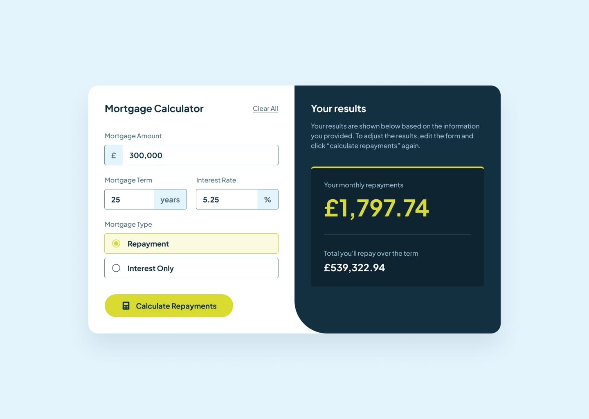

# Frontend Mentor - Mortgage repayment calculator solution 🧮



A simple mortgage calculator built with **React**.  
I created this project to practice core React concepts such as:

- Controlled inputs
- Form validation in React
- Conditional rendering
- Thinking in components
- Reusability

---

## 🚀 Features

- Enter loan amount, interest rate, and loan term to calculate monthly payments.
- Validates inputs (e.g., empty or invalid values).
- Displays clear error messages when inputs are incorrect.
- Renders different states:
  - **Empty state** → before calculation.
  - **Result state** → shows calculation results.
- Built with reusable, composable components.
- Responsive design styled with Tailwind CSS (matches the Figma design).

---

## 🛠️ Tech Stack

- **React** (functional components + hooks)
- **Tailwind CSS** for styling
- **Vite** for fast development build

---

## 📂 Project Structure

```
src/
├── components/
│ ├── UI/ => Reusable UI components (Card, Button, InputField)
│ ├── CalculatorForm.jsx
│ ├── ResultCard.jsx
├── pages/
│ └── Home.jsx
├── utils/
│ └── calcMortgage.js
└── App.jsx
```

---

## 🎯 What I Learned

Through this project, I strengthened my understanding of:

- Managing form state with **controlled components**.
- Implementing **inline validation** and error messages.
- Using **conditional rendering** to manage multiple UI states.
- Structuring apps by **breaking UI into small, reusable components**.
- Designing responsive layouts with Tailwind CSS.

---

## 💻 Getting Started

Clone the repo and run locally:

```bash
# Clone repository
git clone https://github.com/your-username/mortgage-calculator.git

# Navigate into project
cd mortgage-calculator

# Install dependencies
npm install

# Run development server
npm run dev
```

### 📝 License

This project is open source and available under the MIT License.

---
